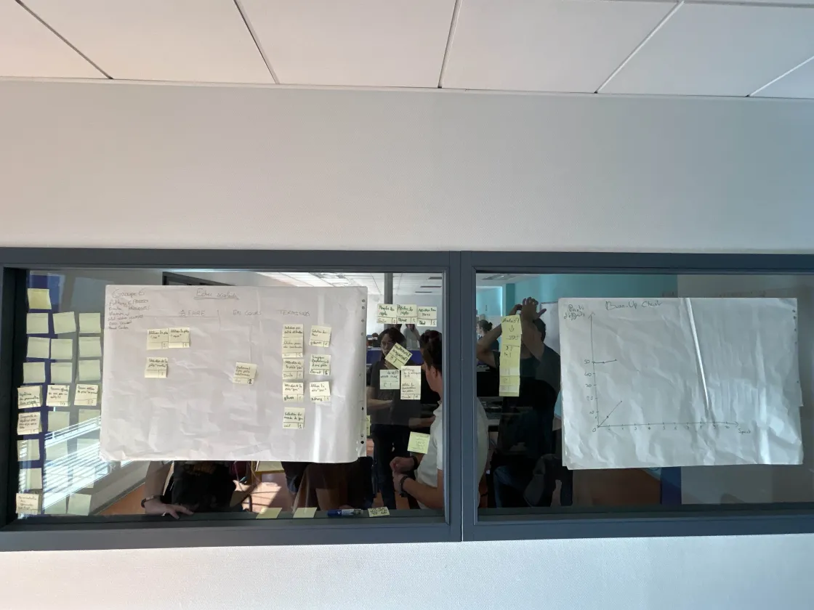

# Sprint 2

Scrum Master : Anthony CARDOSO MOREIRA

## Démo + Planification du sprint suivant

### Ce que nous avons fait durant ce sprint
Selection du menu
Selection des coordonnées des pieces et entrée du joueur
la piece pion, fou et tour
et Selection du mode de jeu

### Ce que nous allons faire durant le prochain sprint
Finir toute les pieces et déplacement d'une piece sélectionné

## Rétrospective

### Sur quoi avons nous butté ?
Lister ici tout ce qui s'est parfaitement bien passé et ce qui n'a pas été parfait.
* ce qu'il s'est parfaitement bien passé pendant le sprint : répartition des US, répartition des taches, organisation 
* ce qu'il ne s'est pas bien passé : on a pas eu le temps de finir le déplacement qu'on a fini par découper en 2 taches et git modification d'un fichier en même temps

### PDCA
* Quel sujet souhaitons nous améliorer ? communication
* Comment améliorer : - prévenir quand on travaille sur un fichier et quand on push - avoir chacun des fichiers attitré - possiblement travailler à deux sur un même pc quand on modifie le même fichier  
* Quelle action mettons nous en place sur le prochain sprint ? on va essayer de toujours prévenir quand on modifie un fichier et qu'on push

# Mémo
