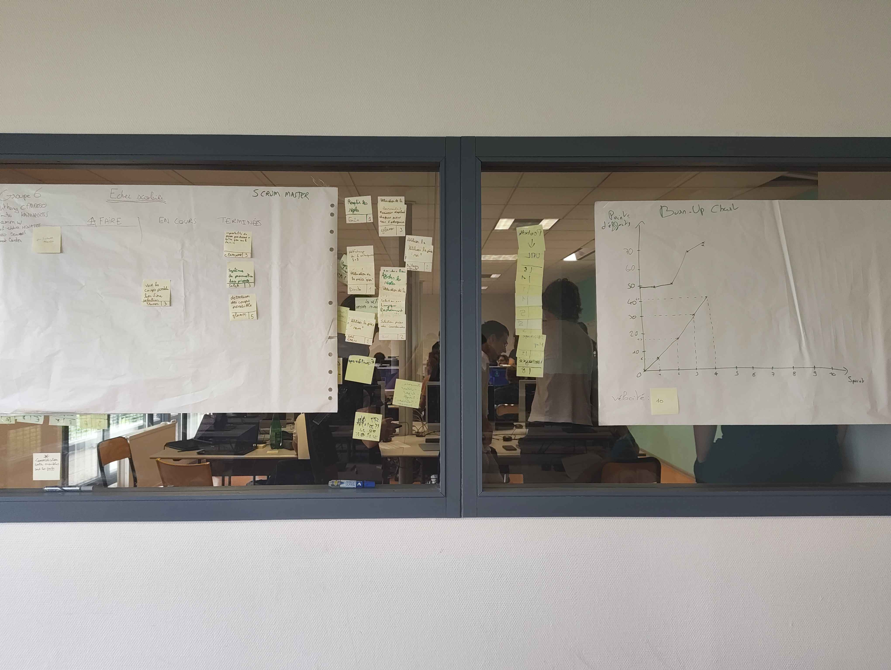

# Sprint 4

Scrum Master : Clément CARDON

## Démo + Planification du sprint suivant

### Ce que nous avons fait durant ce sprint
- Système de promotion des pions
- Detection des coups possibles
- Impossible pour la tour de passer au dessus des autres pièces

### Ce que nous allons faire durant le prochain sprint
- Empêcher les fous et reines de passer au dessus des autres pièces
- Pouvoir voir les coups possibles lors d'une sélection

## Rétrospective

### Sur quoi avons nous butté ?
Lister ici tout ce qui s'est parfaitement bien passé et ce qui n'a pas été parfait.
* ce qu'il s'est parfaitement bien passé pendant le sprint : partage des US et travail en sous-équipes
* ce qu'il ne s'est pas bien passé : les sous-équipes se sont redécoupées le travail, ce qui a créé des disparités dans le rendu

### PDCA
* Quel sujet souhaitons nous améliorer ? Le rendu doit être homogène dans les sous-équipes
* Comment améliorer : Les sous-équipes doivent réellement travailler sur la même US, et pas la redécouper
* Quelle action mettons nous en place sur le prochain sprint ? Pair-programming : les sous-équipes travaillent sur le même poste

# Mémo
