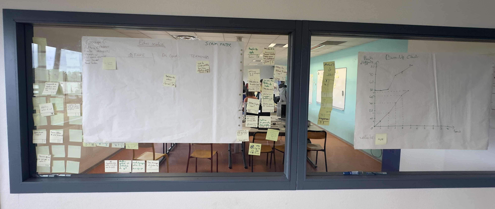

# Sprint 5

Scrum Master : Clément CARDON

## Démo + Planification du sprint suivant

### Ce que nous avons fait durant ce sprint
- Impossible pour le fou de passer au dessus des autres pièces
- Symbolisation visuelle des cases possibles
- Promotion des pions

### Ce que nous allons faire durant le prochain sprint
- Finalisation du système de mise en échec
- Détection des échecs et mats

## Rétrospective

### Sur quoi avons nous butté ?
Lister ici tout ce qui s'est parfaitement bien passé et ce qui n'a pas été parfait.
* ce qu'il s'est parfaitement bien passé pendant le sprint : Les équipes se sont concentrés sur leurs tâches de manière efficaces et ont bien communiqué ensembles
* ce qu'il ne s'est pas bien passé : trop de temps passé sur un bug

### PDCA
* Quel sujet souhaitons nous améliorer ? Plus d'efficacité
* Comment améliorer : En découpant mieux les tâches et en mieux les estimant
* Quelle action mettons nous en place sur le prochain sprint ? Meilleure estimation des tâches et du poids des US

# Mémo
