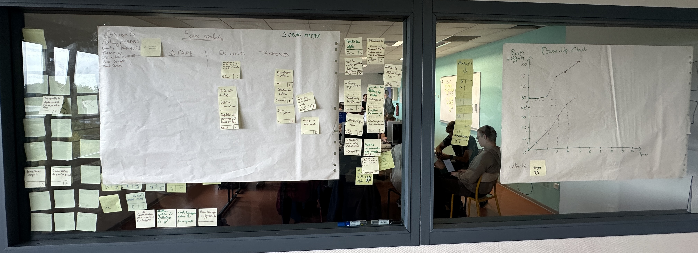

# Sprint 6

Scrum Master : Dimitri KAIMAKLIOTIS

## Démo + Planification du sprint suivant

### Ce que nous avons fait durant ce sprint
- Mise en place du mode multijoueur
- Creation de la detection des echecs (et debut des echecs et mat)

### Ce que nous allons faire durant le prochain sprint
- Finalisation du système de multijoueur et de fin de partie
- Finir la gestion complète du systeme de fin de partie classique local.

## Rétrospective

### Sur quoi avons nous butté ?
Lister ici tout ce qui s'est parfaitement bien passé et ce qui n'a pas été parfait.
* ce qu'il s'est parfaitement bien passé pendant le sprint : Les équipes se sont concentrés sur le fait de se répartir deux grosses taches differentes, et on reussi a bien communiquer entre eux, a travers du peer-programming et l'écoute entre membres de l'équipe.
* ce qu'il ne s'est pas bien passé : certains conflits git nous ont faits perdre quelques précieuses minutes.

### PDCA
* Quel sujet souhaitons nous améliorer ? Regler les conflits Git plus rapidement pour ne pas nous impacter à la longue.
* Comment améliorer : En ce concentrant à bien travailler sur des foctionnalités differentes.
* Quelle action mettons nous en place sur le prochain sprint ? Meilleure gestion des conflits importants.

# Mémo
