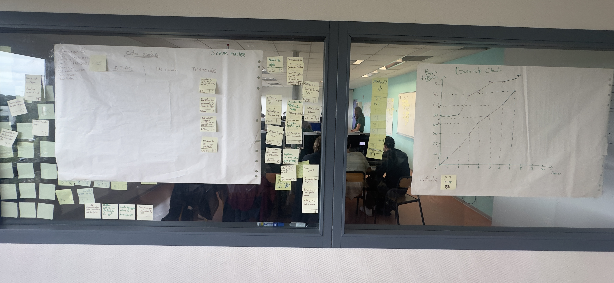

# Sprint 7

Scrum Master : Dimitri KAIMAKLIOTIS

## Démo + Planification du sprint suivant

### Ce que nous avons fait durant ce sprint
- Finalisation du mode multijoueur avec système d'abandon et suppression
- Echecs et correction des bugs mineurs
- Mise en place de nouveaux modes de jeu alternatifs

### Ce que nous allons faire durant le prochain sprint
- Finaliser les roques
- Commencer le developpmeent des echecs et mat

## Rétrospective

### Sur quoi avons nous butté ?
Lister ici tout ce qui s'est parfaitement bien passé et ce qui n'a pas été parfait.
* ce qu'il s'est parfaitement bien passé pendant le sprint : on a bien su réaliser la totalité des US que l'on s'etait fixé, sans sur ni sous éstimer.
* ce qu'il ne s'est pas bien passé : On a eu beaucoup de mal à bien trvailler en même temps étant donné que nous devions tous toucher aux mêmes fichiers et de façon tres proche (lignes proches)

### PDCA
* Quel sujet souhaitons nous améliorer ? Estimer dans quels fichiers nous devons travailler pour mettre en peer-prog ceux qui font des fonctionnalités proche (proche dans les fichiers, et non dans la logique forcement).
* Comment améliorer : Regrouper certains membres pour qu'il travaille en mini-groupe ensemble.
* Quelle action mettons nous en place sur le prochain sprint ? Peer-programming plus précis.

# Mémo
