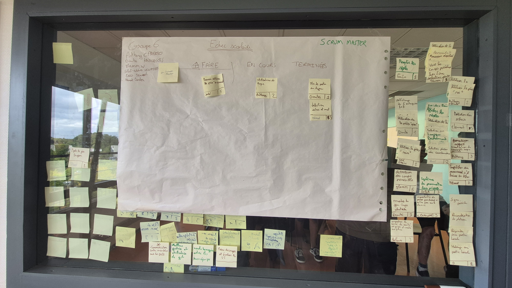
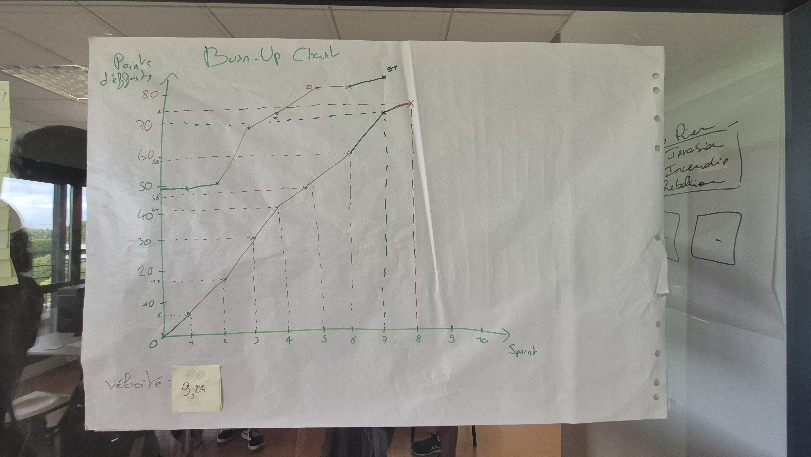

# Sprint 8

Scrum Master : Enzo Dewaele

## Démo + Planification du sprint suivant

### Ce que nous avons fait durant ce sprint
<!-- Donnez ici la liste des histoires utilisateurs que vous avez livrées durant ce sprint.
Vous pouvez utiliser cette liste pour préparer votre démo. -->

- Détection des échecs et mat, il est maintenant possible de finir une partie grâce à la détection des échecs et mat
- Fin de partie en ligne, grâce à la détection des échecs et mat, il est possible de finir une partie.

### Ce que nous allons faire durant le prochain sprint
- Pouvoir faire un petit roque et un grand roque, il sera possible pour les joueurs de faire un roque avec le roi.
- Pouvoir faire une prise en passant, il sera possible pour les joueurs de faire une prise en passant avec leurs pions.

## Rétrospective

### Sur quoi avons nous butté ?
<!-- Lister ici tout ce qui s'est parfaitement bien passé et ce qui n'a pas été parfait.
* Qu'est ce qu'il s'est parfaitement bien passé pendant le sprint (démo, rétro, organisation, répartition des US, répartition des taches, prédictibilité, technique, git, java, ide, etc.
* Qu’est-ce qui m'a irrité ? dérangé ? -->

- Durant ce sprint, nous n'avons pas eu de problème majeur sur git, tout le monde attend et demande pour éviter les conflits. Pas de problème avec Java et nos idées.

### PDCA
Nous voulons améliorer le calcul des points d'effort.
Pour cela, nous prendrons plus de temps pour attribuer les points d'effort.

# Mémo

### Kanban

### BurnUp
