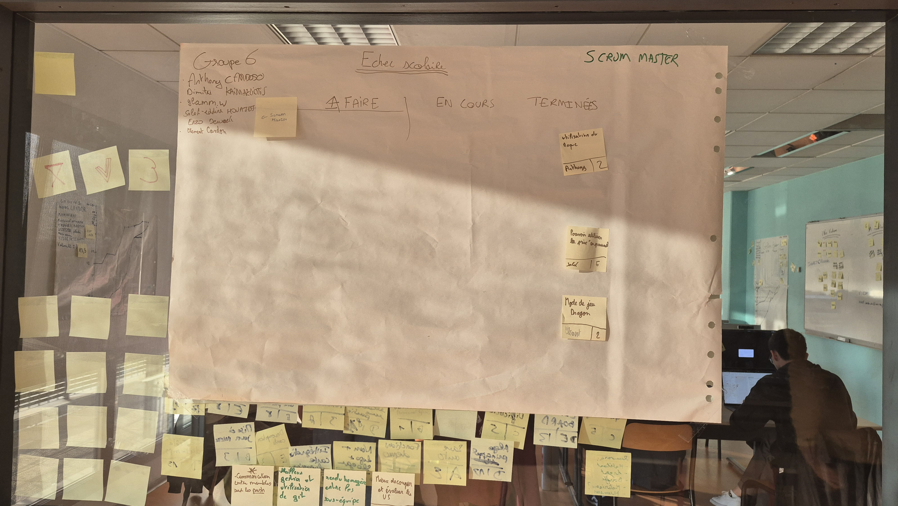
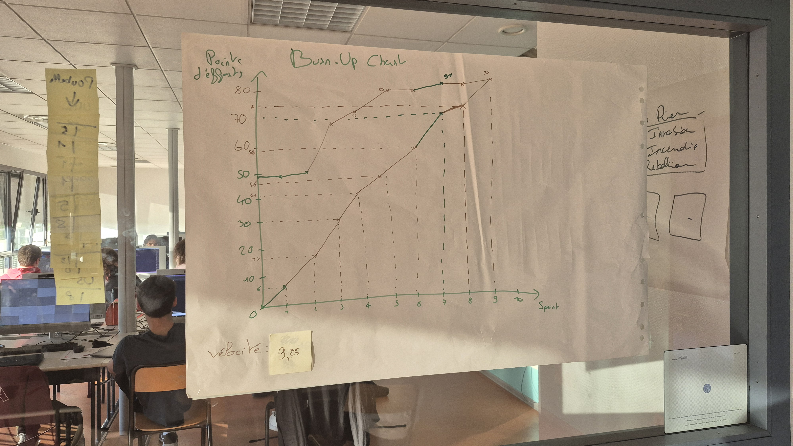

# Sprint 9

Scrum Master : Enzo Dewaele

## Démo + Planification du sprint suivant

### Ce que nous avons fait durant ce sprint

<!-- Donnez ici la liste des histoires utilisateurs que vous avez livrées durant ce sprint.
Vous pouvez utiliser cette liste pour préparer votre démo. -->

- Utilisation du roque, il est maintenant possible pour les utilisateurs de faire un grand roque et un petit roque avec leur roi.
- Pouvoir utiliser la prise en passant, il est maintenant possible pour les utilisateurs de faire une prise en passant avec leur pion.
- Mode de jeu dragon, les utilisateurs peuvent maintenant jouer au mode de jeu dragon qui ajoute la piece dragon qui peut faire les mouvement du cavalier et du fou.

### Ce que nous allons faire durant le prochain sprint

<!-- Donnez ici la liste des histoires utilisateurs que vous vous engagez à terminer durant le prochain sprint. -->

Nous n'avons plus de tâche prévue.

## Rétrospective

### Sur quoi avons nous butté ?

<!-- Lister ici tout ce qui s'est parfaitement bien passé et ce qui n'a pas été parfait.
* Qu'est ce qu'il s'est parfaitement bien passé pendant le sprint (démo, rétro, organisation, répartition des US, répartition des taches, prédictibilité, technique, git, java, ide, etc.
* Qu’est-ce qui m'a irrité ? dérangé ? -->

- Notre démo s'est bien passée, nous avons présenté les nouvelles fonctionnalités. Nous avons fini toutes nos US.

- Nous avons eu un conflit git à résoudre.

### PDCA

* Quel sujet souhaitons nous améliorer ? (1 seul)
* Comment améliorer (3 options recommandés)
* Quelle action mettons nous en place sur le prochain sprint ?

# Mémo

### Kanban

### BurnUp
